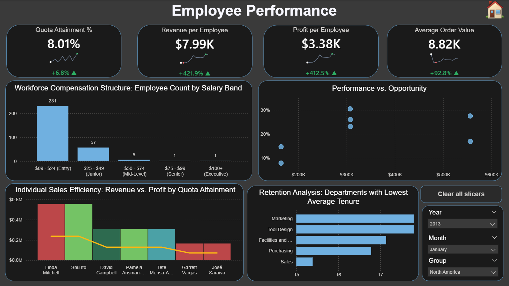
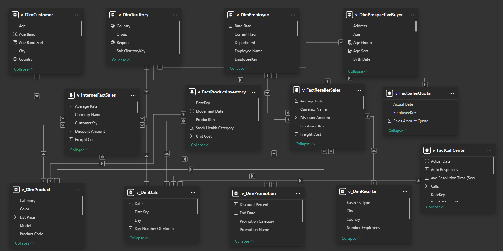

# AdventureWorks: Global Sales & Manufacturing Intelligence Suite

## 📖 Project Overivew

The organization needed a centralized **"Single Source of Truth"** to monitor global operations, identify revenue leaks in the supply chain, and evaluate the ROI of various promotional campaigns. 

This project transforms raw transactional data from the **AdventureWorks 2025** database into a comprehensive, 7-page business intelligence suite. It provides stakeholders with actionable insights into executive health, customer behavior, supply chain efficiency, and employee performance.

---

## 🚀 Documentation & Quick Links

* 📊 **[Download Power BI Dashboard (.pbix)](Report_and_Dashboard/AdventureWorks_Executive_Suite.pbix)** - *Requires Power BI Desktop to view data model and DAX*
* 📄 **[Download Project Summary (PDF)](Report_and_Dashboard/AdventureWorks_Executive_Suite.pdf)** - *A comprehensive report of insights and methodology*
* 💻 **[View SQL Scripts](Sql-Scripts/AdventureWork_Gold_Layer_View.sql)** - *Database views and transformation logic*
* 🗄️ **[Source Data (.bak)](AdventureWorks2025_Source/AdventureWorksDW2025.bak)** - *(24.1 MB)*

---

## 🖥️ Dashboard Preview

### 1. Executive Overview (Featured)

The "Big Picture" view for C-suite stakeholders to monitor organizational health. Includes Core Metrics tracking Total Revenue ($2.03M) and a Pareto Analysis for revenue concentration.

### 2. Deep-Dive Reporting Pages (Click to Expand)

  
📸 Click to view all 6 additional dashboard pages

  #### Navigation Hub
  The entry point of the suite, featuring a clean, button-based UI for seamless navigation.
  
  
  #### Product Analysis
  Granular look at inventory performance and a Price Positioning vs. Profitability scatter plot.
  
  
  #### Customer Insights
  Demographic and behavioral segmentation identifying high-value "Professional" and "Management" roles.
  
  
  #### Supply Chain Operations
  Focused on stock efficiency, featuring "Inbound vs. Outbound" trend monitoring and Inventory Turnover (11.5x).
  
  
  #### Employee Performance
  HR and Sales leadership view monitoring workforce efficiency and Quota Attainment % (8.01%).
  
  
  #### Promo ROI Analysis
  Compares Total Promo Sales against Discount costs to identify the highest-returning campaigns.
  

---

## 🛠️ Technical Stack & Architecture

### 1. SQL Engineering (The Gold Layer)

Instead of loading raw tables, I engineered **T-SQL Views** to pre-aggregate data and ensure high performance:
* **`v_FactInternetSales`**: Handled data cleaning for customer demographics.
* **`v_FactInventory`**: Calculated complex inventory metrics (Inbound vs. Outbound) at the source.
* **Techniques**: Joins, CTEs, Data Type Casting, and View Materialization.

### 2. Data Modeling

The Power BI model follows a robust **Star Schema** design with 11+ tables for optimal performance:
* **Fact Tables**: Internet Sales, Reseller Sales, Product Inventory, Sales Quotas.
* **Dimension Tables**: Product, Date, Customer, Territory, Employee, Promotion.

### 3. Advanced DAX & Analytics

* **Pareto Analysis**: Implemented the 80/20 rule to identify top-performing product models driving 80% of revenue.
* **Time Intelligence**: Developed Year-over-Year (YoY) growth metrics for revenue and profit.
* **Trend Forecasting**: Utilized combination bar/line charts to track volume growth against return rates.

---

## 📈 Key Business Insights

* **Revenue Concentration:** 80% of revenue is generated by the top 20% of product models (primarily Mountain Bikes), suggesting a need for focused inventory management.
* **Inventory Bottlenecks:** Identified significant revenue impact due to inventory deficits in the "Accessories" category during peak months.
* **Quality Control:** Spotted a critical **80.38% Return Rate** in specific product categories, flagging a need for an immediate manufacturing audit.
* **Customer Value:** Professional and Management occupation groups yield the highest "Average Revenue per Customer."

---

**Author:** Meenakshi Singh  
*Data Analyst | SQL Engineering | Power BI Architecture*

