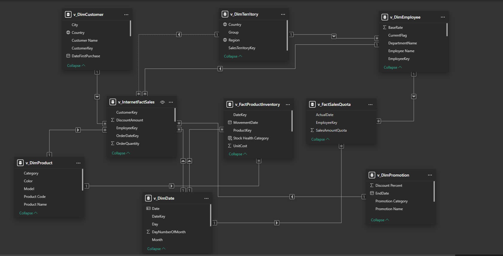

## AdventureWorks Executive BI Suite

### 📊 End-to-End Business Intelligence Solution

### 📌 Project Overview

This project transforms raw transactional data into a multi-page, interactive Power BI executive suite. It is designed to provide stakeholders with actionable insights across sales, product lifecycle, supply chain efficiency, and employee productivity.

---

### 🛠️ Technical Architecture

- **Data Modeling**: Transformed a complex snowflake schema into a high-performance Star Schema for optimized DAX calculations.

- **UI/UX Design**: Implemented a custom dark-themed interface with a centralized Navigation Hub, synchronized slicers, and F-pattern layouts for readability.

- **Advanced Analytics**: Utilized DAX for complex metrics including Pareto (80/20) analysis, Inventory turnover, and Quota attainment.

---

### 💾 SQL Engineering (Gold Layer)

To ensure data integrity and performance, I developed a suite of T-SQL Views to serve as the "Gold Layer" for the Power BI model. 

* **ETL Logic:** Implemented `LEFT JOIN` logic to denormalize product and geography hierarchies.
* **Calculated Columns:** Engineered business logic directly in SQL (e.g., tenure calculations and profit margin formulas) to reduce DAX overhead.
* **Data Pruning:** Filtered datasets to include only active employees and relevant fiscal years (2010+).

[View the full SQL Script here](sql-scripts/gold_view.sql)

---

### ⭐ Data Model (Gold Layer)

The analytical model is designed as a Star Schema, ensuring efficient query performance and clear relationship management:

- **Fact Table**: v_InternetFactSales, v_FactProductInventory, v_FactSalesQuota (includes KPIs like is_late_delivery and delivery_status).

- **Dimension Tables**: v_DimCustomers, v_DimProducts, v_DimTerritory, v_DimEmployee, v_DimPromotion v_DimDate.

  
 Data Model 

   
  

---

### 📊 Dashboard Previews & Business Insights

**User Experience**: Implemented a centralized "app-like" landing page to provide intuitive access to all 6 specialized report domains.

*Click each section below to expand the screenshot.*

  
 🏠 Home Page 

   
  

  - A centralized "Command Center" featuring high-fidelity page navigators and synchronized bookmarks to provide an intuitive, app-like user experience across all 6 analytical domains
  

  
 📊 Executive Overview 

   
  

- Global Revenue: Analyzed $44.35M in Total Sales with the United States driving over 50% of global market share.

- Profitability: Tracked $18.32M in Total Profit, monitoring the 41.3% margin stability through seasonal trends.

- Top Performance: Identified "Road Bikes" as the primary revenue subcategory, contributing $21.5M to the bottom line.

  
 📦 Product Analysis 

   
  

- Pareto Principle: Visualized that the top 30.2% of models generate the majority of revenue, allowing for inventory prioritization.

- Portfolio Health: Used a scatter plot to identify "underperformers" (High volume, low margin) versus "stars" (High volume, high margin).

- Inventory Turnover: Measured a 4.4 turnover rate, signaling a healthy "Surplus" position for top-selling models.

  
 🌐 Customer Insights 

   
  

- Loyalty Metrics: Achieved a 37.14% Repeat Customer Rate, a key KPI for measuring long-term brand health.

- Segmentation: Correlated revenue vs. purchase frequency by occupation, identifying "Management" and "Professional" tiers as highest-value segments.

- Demographics: Binned yearly income to identify the $50K–$100K bracket as the core purchasing demographic.

  
 🚚 Supply Chain Operations 

   
  

- Inventory Risk: Identified a -4K net stock position, flagging a critical "Inventory Deficit" that threatens potential revenue.

- Flow Analysis: Tracked monthly "Inbound vs. Outbound" volume to optimize warehouse labor and storage allocation.

- Impact Mapping: Visualized the specific products in deficit (e.g., Mountain-200 frames) to prioritize replenishment.

  
 ⭐ Employee Performance 

   
  

- Quota Tracking: Monitored the global sales force against a $51.4M target, identifying a current 46.34% attainment level.

- Force Distribution: Categorized employees into performance tiers, revealing that while 4 are "Elite," 8 are currently "At Risk."

- Departmental Efficiency: Analyzed salary budget allocation, showing "Production" as the primary resource driver at 46.24%.

  
 📣 Promo Analysis 

   
  

- Discount Efficiency: Proved that "Volume Discounts" maintain a high ROI, driving $3.06M in sales with only a 0.17% discount impact.

- Promotion Mix: Identified that Volume Discounts account for over 97% of promotional revenue.

- Seasonality: Tracked "New Product" vs. "Volume Discount" effectiveness across the fiscal calendar to optimize marketing spend.

---

### 🛠️ Technologies Used

- **SQL Server & T-SQL**: ETL pipelines and Gold layer view creation.

- **Power BI**: DAX, Star Schema Modeling, Interactive UI.

- **GitHub**: Version control and documentation.

  ---

  *[Download the Power BI report file here](https://github.com/Meenakshi0313/AdventureWorks-Executive-BI-Suite/blob/main/Power%20BI/AdventureWorks_Executive_Suite.pbix).*

  ---

  ### Author: 

Meenakshi Singh | Data Analyst | SQL | Data Modeling | Business Intelligence
