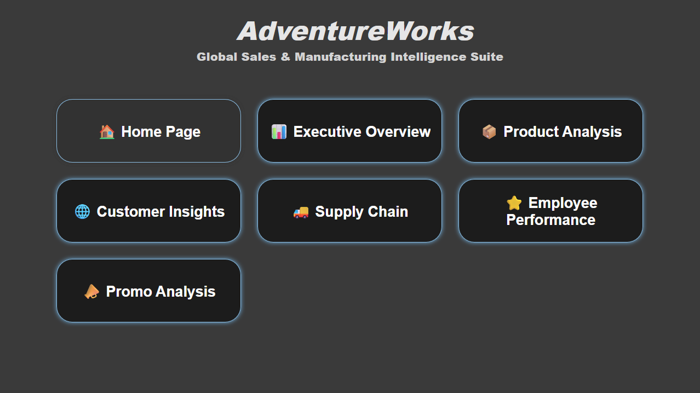
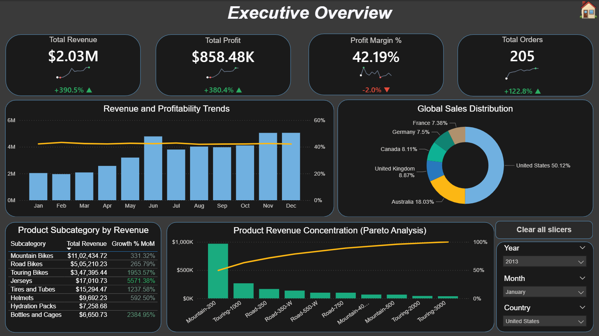
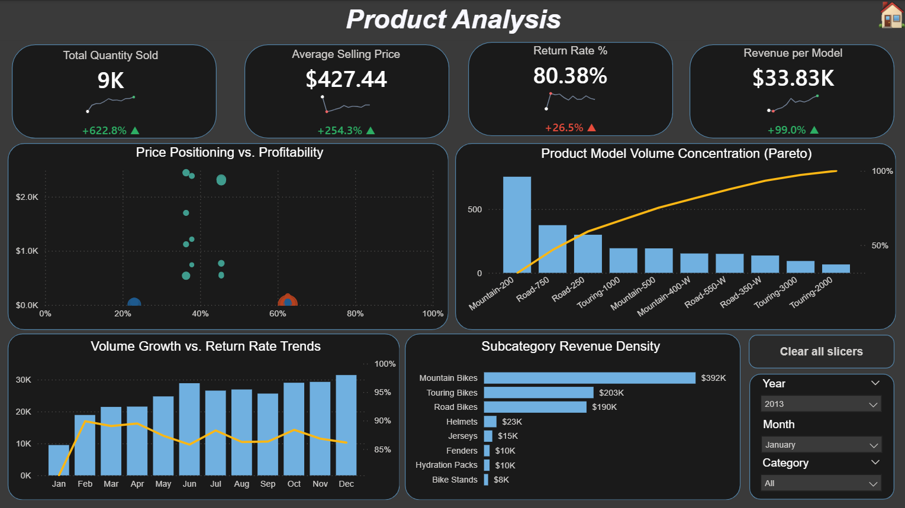
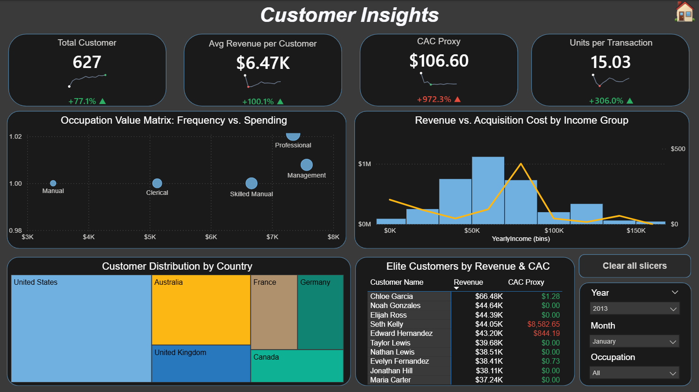
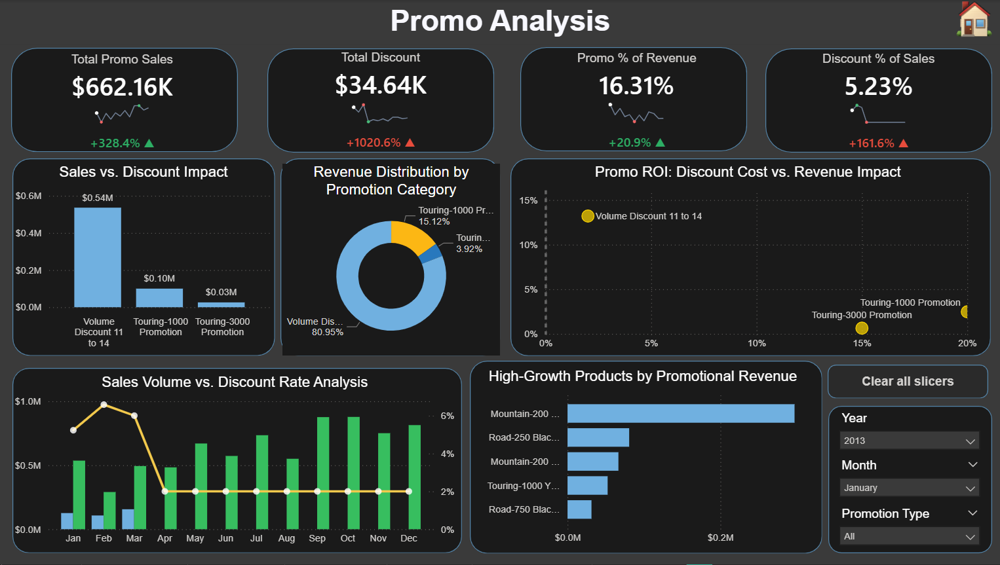

# AdventureWorks: Global Sales & Manufacturing Intelligence Suite

## 📌 Project Overview

This project transforms raw, fragmented transactional data into a **7-page, high-fidelity Executive Intelligence Suite**. Designed for a global manufacturing scale, this suite provides stakeholders with a "Command Center" view of the business—bridging the gap between high-level financial health and granular operational efficiency.

---

### 🔗 Quick Access

* 📊 [**View Executive Performance Report (PDF)**](Report_and_Dashboard/AdventureWorks_Executive_Suite.pdf)
  
* 🛠️ [**Download Power BI Dashboard (.pbix)**](Report_and_Dashboard/AdventureWorks_Executive_Suite.pbix)
  
* 💾 [**View SQL Gold-Layer Transformation Scripts**](Sql-Scripts/AdventureWork_Gold_Layer_View)

 ---
 
## 🛠️ Technical Architecture

* **Data Modeling:** Engineered a high-performance **Star Schema** from a complex snowflake source, optimizing filter propagation for sub-second DAX visual rendering.
* **Advanced DAX Engineering:** Developed complex measures for behavioral analytics, including **Pareto (80/20) distributions**, **Inventory Velocity**, and dynamic **Quota Attainment** tracking.
* **UI/UX Design:** Implemented a "Dark Mode" aesthetic with an **App-like Navigation Hub**, synchronized slicers for cross-page state management, and F-pattern layouts to reduce cognitive load.

---

## 🗄️ SQL Engineering (The "Gold Layer")

To ensure a "Single Source of Truth," I developed a suite of **T-SQL Views** to serve as the semantic layer for the Power BI model.
* **Hierarchy Denormalization:** Flattened product and geography hierarchies using `LEFT JOIN` logic.
* **Business Logic Layer:** Offloaded heavy calculations (e.g., tenure and profit margins) to SQL to minimize DAX overhead.
* **Data Pruning:** Filtered legacy datasets to focus on active employees and relevant fiscal cycles (2010+)

---

## 📊 Suite Insights

(Click to expand screenshots)

🏠 <b>Home Page: Navigation Hub</b>

 
A centralized entry point featuring high-fidelity page navigators. 
  
  

📊 <b>Executive Overview: Financial Health</b>

 
* Analyzed $44.35M in Total Sales with 41.3% margin stability.
* Visualized global revenue distribution and flagship product performance.
  
  

📦 <b>Product Analysis: Pareto & Portfolio</b>

 
* Identified that the **top 30.2% of models** drive the majority of revenue.  
* Used Scatter Plots to segment "Star" products from "Underperformers."
  
  

🌐 <b>Customer Insights: Behavioral Segmentation</b>

 
* Achieved a <b>37.14% Repeat Customer Rate</b>.
  
* Engineered DAX Slicers for <b>"High Value" (>$5k)</b> vs. Standard tiers.
  
  

🚚 <b>Supply Chain: Risk & Deficit Mapping</b>

 
* Identified <b>-4K net stock position</b> in high-demand lines.
* Mapped inventory deficits directly to revenue-at-risk for replenishment priority.
  
  

⭐ <b>Employee Performance: Quota Tracking</b>

 
* Monitored real-time progress against a <b>$51.4M global target</b>.
* Developed "Elite" vs "At Risk" performance tiering logic.
  
  

📣 <b>Promo Analysis: ROI & Discount Impact</b>

 
* Proved <b>Volume Discounts</b> drive $3.06M in sales with minimal margin impact.
* Analyzed promo effectiveness across the fiscal calendar.
  
  

---

## 🛠️ Technologies Used

* **SQL Server:** T-SQL, Views, Schema Design.
* **Power BI:** Star Schema Modeling, Advanced DAX, Sparklines, UX/UI Design.
* **GitHub:** Version Control and Documentation.

---

# Author: Meenakshi Singh

Data Analyst | SQL Engineering | Power BI Architecture

  ---
  

