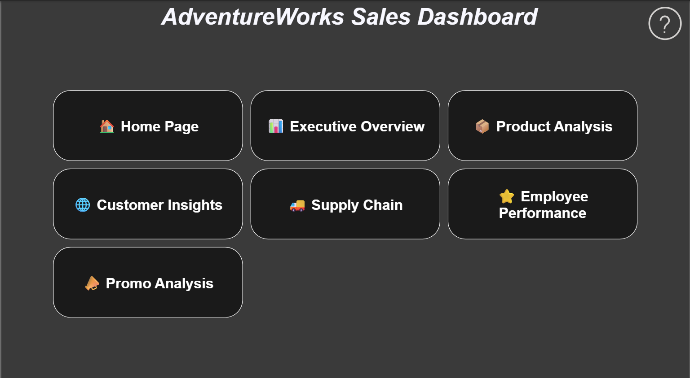
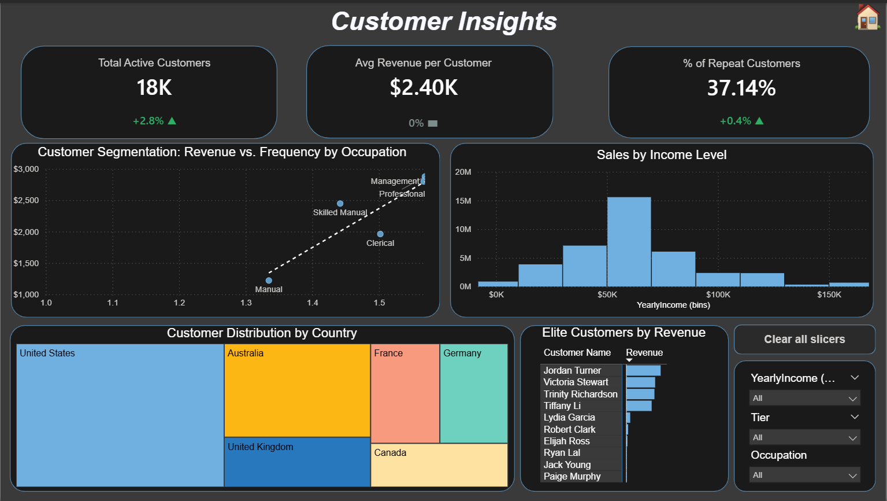
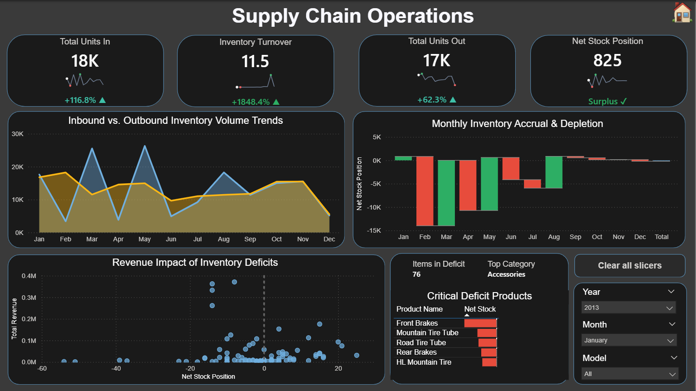
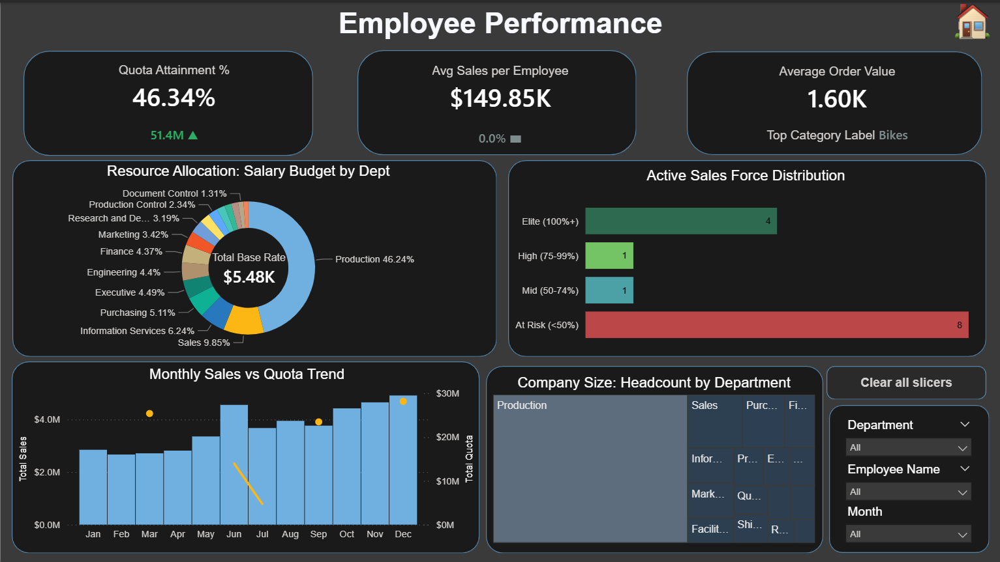
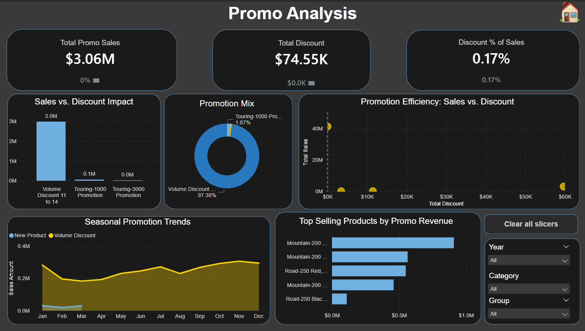

### AdventureWorks Executive BI Suite

## 📊 End-to-End Business Intelligence Solution

## 📌 Project Overview

This project transforms raw transactional data into a multi-page, interactive Power BI executive suite. It is designed to provide stakeholders with actionable insights across sales, product lifecycle, supply chain efficiency, and employee productivity.

## 🛠️ Technical Architecture

**Data Modeling**: Transformed a complex snowflake schema into a high-performance Star Schema for optimized DAX calculations.

**UI/UX Design**: Implemented a custom dark-themed interface with a centralized Navigation Hub, synchronized slicers, and F-pattern layouts for readability.

**Advanced Analytics**: Utilized DAX for complex metrics including Pareto (80/20) analysis, Inventory turnover, and Quota attainment.

## 📊 Dashboard Previews & Business Insights

**User Experience**: Implemented a centralized "app-like" landing page to provide intuitive access to all 6 specialized report domains.

*Click each section below to expand the screenshot.*

  
 🏠 Home Page 

   
  

  
 📊 Executive Overview 

   
  

  
 📦 Product Analysis 

   
  

  
 🌐 Customer Insights 

   
  

  
 🚚 Supply Chain 

   
  

  
 ⭐ Employee Performance 

   
  

  
 📣 Promo Analysis 

   
  

