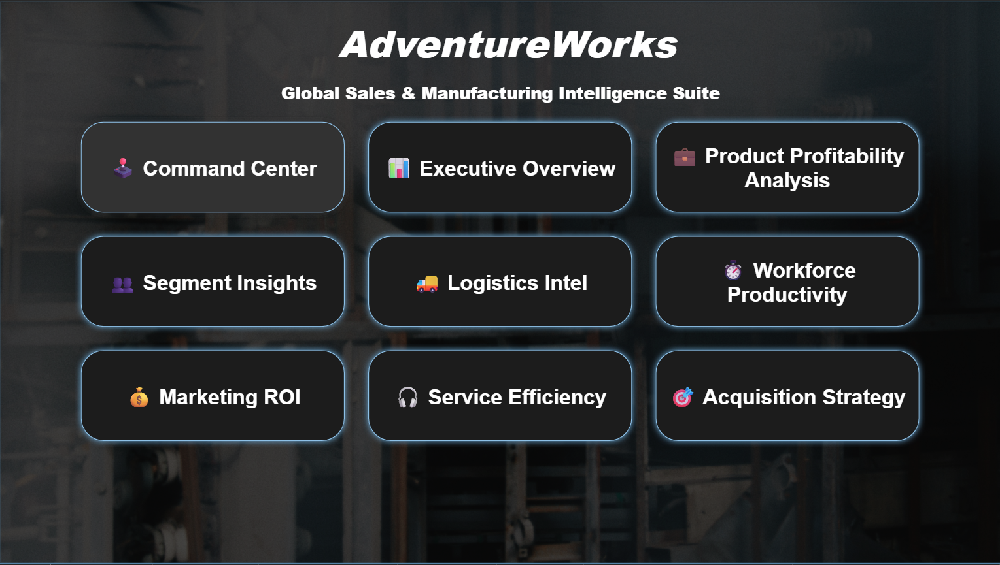
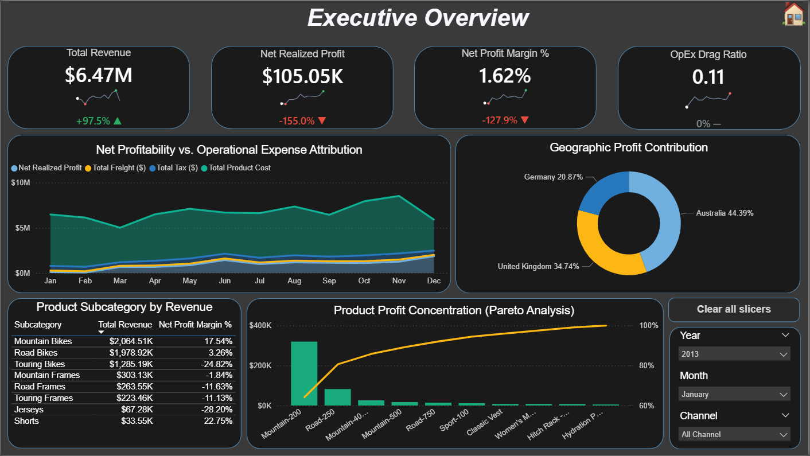
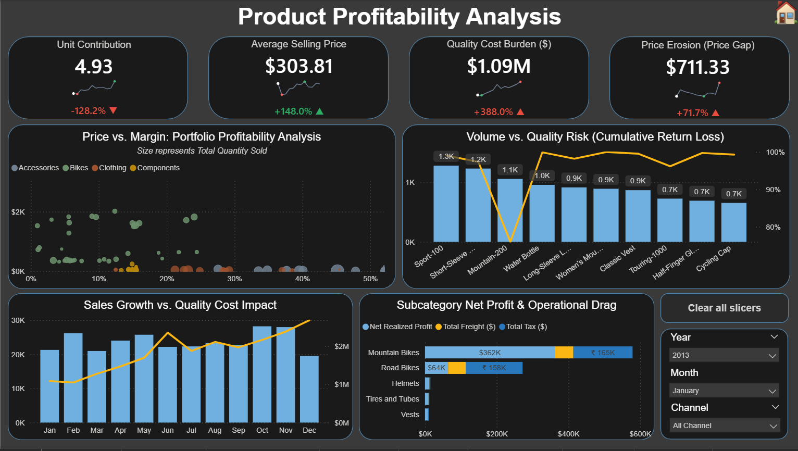
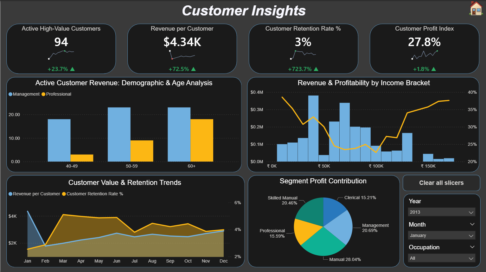
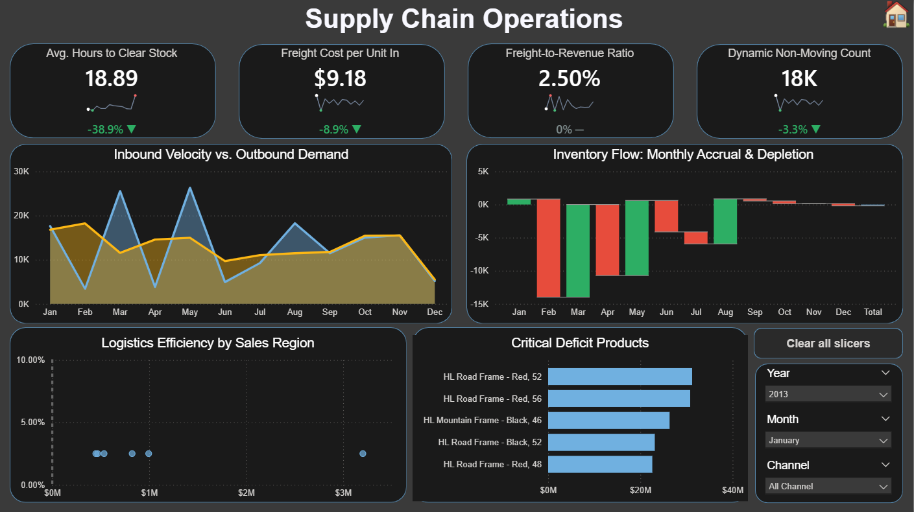
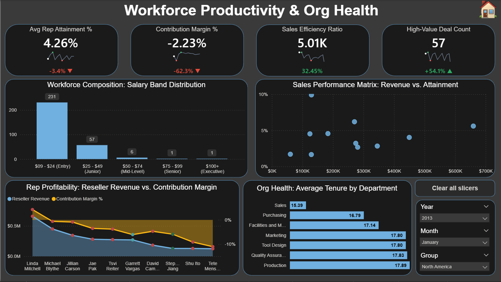
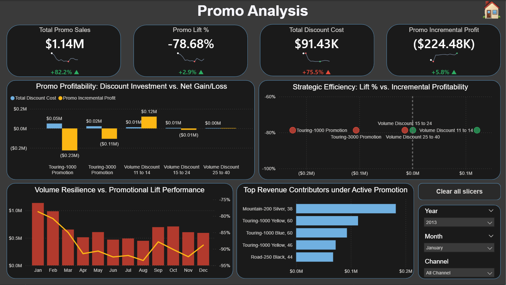
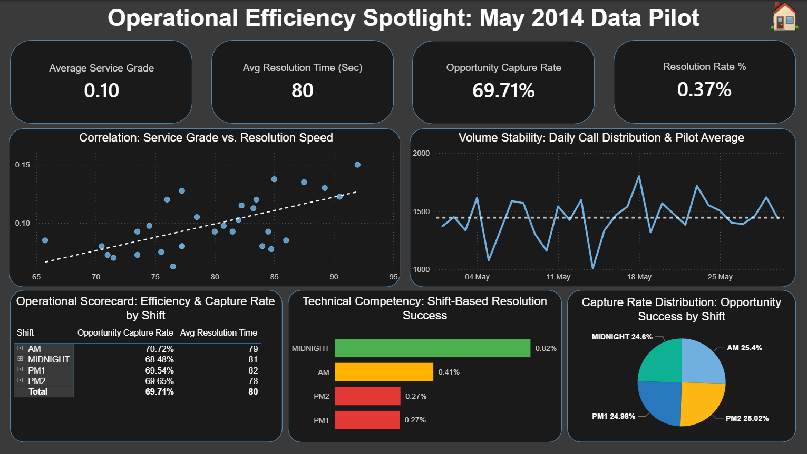
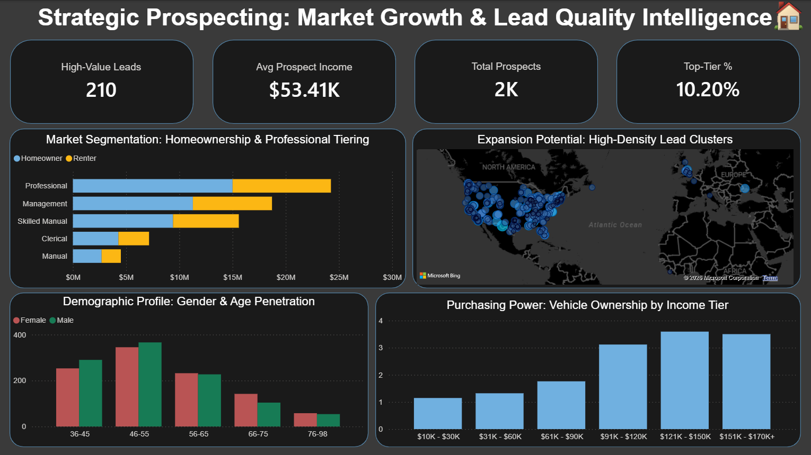

# AdventureWorks: Global Sales & Manufacturing Intelligence Suite

## 📖 Project Overivew
## 📖 Project Overview
The organization required a centralized **"Single Source of Truth"** to bridge the gap between global sales performance and manufacturing efficiency. This project transforms raw transactional data into a high-fidelity, 9-page executive BI suite. 

The organization needed a centralized **"Single Source of Truth"** to monitor global operations, identify revenue leaks in the supply chain, and evaluate the ROI of various promotional campaigns. 
By implementing a **T-SQL Gold Layer** and a custom **Power BI Executive Interface**, I provided stakeholders with a unified view of revenue health, supply chain bottlenecks, and marketing ROI.

---

## 🚀 Documentation & Quick Links
<<<<<<< HEAD

* 📊 **[Download Power BI Dashboard (.pbix)](Report_and_Dashboard/AdventureWorks_Executive_Suite.pbix)** - *Requires Power BI Desktop to view data model and DAX*
* 📄 **[Download Project Summary (PDF)](Report_and_Dashboard/AdventureWorks_Executive_Suite.pdf)** - *A comprehensive report of insights and methodology*
* 💻 **[View SQL Scripts](Sql-Scripts/01_Gold_Reporting_Views.sqll)** - *Database views and transformation logic*
* 🗄️ **[Source Data (.bak)](AdventureWorks2025_Source/AdventureWorksDW2025.bak)** - *(24.1 MB)*
=======
* 📊 **[Download Power BI Dashboard (.pbix)](Report_and_Dashboard/AdventureWorks_Executive_Suite.pbix)**
* 📄 **[Download Project Summary (PDF)](Report_and_Dashboard/AdventureWorks_Executive_Suite.pdf)**
* 💻 **[View SQL "Gold Layer" Scripts](Sql-Scripts/01_Gold_Reporting_Views.sql)**
* 🗄️ **[Source Data (.bak)](AdventureWorks2025_Source/AdventureWorksDW2025.bak)**
>>>>>>> 20d431e4ea99eb1f702d3c38660228fc6eadd521

---

## 🖥️ Dashboard Preview
## 🖥️ Interactive Dashboard Suite
Click on any module below to view the high-resolution preview directly from the assets folder.

| Module | Analytical Focus | High-Res Preview |
| :--- | :--- | :--- |
| **01. Command Center** | Global Navigation & Entry Point | [🖼️ View](./Assets/01_Command-Center.png) |
| **02. Executive Overview** | C-Suite Financial & Pareto Health | [🖼️ View](./Assets/02_Executive-Overview.png) |
| **03. Product Profitability** | Unit Contribution & Price Erosion | [🖼️ View](./Assets/03_Product-Profitability-Analysis.png) |
| **04. Segment Insights** | Demographic & Income Distribution | [🖼️ View](./Assets/04_Segment-Insights.png) |
| **05. Logistics Intel** | Freight Ratios & Supply Velocity | [🖼️ View](./Assets/05_Logistic-Intel.png) |
| **06. Workforce Productivity** | Attainment & Org Health Metrics | [🖼️ View](./Assets/06_Workforce-Productivity.png) |
| **07. Marketing ROI** | Promo Lift & Incremental Profit | [🖼️ View](./Assets/07_Marketing-ROI.png) |
| **08. Service Efficiency** | Operational Pilot & Shift Success | [🖼️ View](./Assets/08_Service-Efficiency.png) |
| **09. Acquisition Strategy** | Market Growth & Lead Quality | [🖼️ View](./Assets/09_Acquisition-Strategy.png) |

  
📸 **Click here to expand and view all screenshots in-line**

The "Big Picture" view for C-suite stakeholders to monitor organizational health. Includes Core Metrics tracking Total Revenue ($2.03M) and a Pareto Analysis for revenue concentration.

  ### 01. Command Center
  

### 2. Deep-Dive Reporting Pages (Click to Expand)

  
📸 Click to view all 6 additional dashboard pages

  #### Navigation Hub
  The entry point of the suite, featuring a clean, button-based UI for seamless navigation.
  
  
  #### Product Analysis
  Granular look at inventory performance and a Price Positioning vs. Profitability scatter plot.
  
  
  #### Customer Insights
  Demographic and behavioral segmentation identifying high-value "Professional" and "Management" roles.
  
  
  #### Supply Chain Operations
  Focused on stock efficiency, featuring "Inbound vs. Outbound" trend monitoring and Inventory Turnover (11.5x).
  
  
  #### Employee Performance
  HR and Sales leadership view monitoring workforce efficiency and Quota Attainment % (8.01%).
  
  
  #### Promo ROI Analysis
  Compares Total Promo Sales against Discount costs to identify the highest-returning campaigns.
  
  ### 02. Executive Overview
  

  ### 03. Product Profitability
  

  ### 04. Segment Insights
  

  ### 05. Logistics Intel
  

  ### 06. Workforce Productivity
  

  ### 07. Marketing ROI
  

  ### 08. Service Efficiency
  

  ### 09. Acquisition Strategy
  

---

## 🛠️ Technical Stack & Architecture

### 1. SQL Engineering (The Gold Layer)

### 1. SQL Engineering: The Gold Layer

Instead of loading raw tables, I engineered **T-SQL Views** to pre-aggregate data and ensure high performance:
* **`v_FactInternetSales`**: Handled data cleaning for customer demographics.
* **`v_FactInventory`**: Calculated complex inventory metrics (Inbound vs. Outbound) at the source.
* **Techniques**: Joins, CTEs, Data Type Casting, and View Materialization.
* **Materialized Logic**: Shifted complex transformations from the BI tool to the database, optimizing refresh speeds.
* **Data Integrity**: Developed a "Gold Layer" architecture for clean, reporting-ready data contracts.

### 2. Data Modeling
### 2. Advanced Data Modeling

The Power BI model follows a robust **Star Schema** design with 11+ tables for optimal performance:
* **Fact Tables**: Internet Sales, Reseller Sales, Product Inventory, Sales Quotas.
* **Dimension Tables**: Product, Date, Customer, Territory, Employee, Promotion.
The suite is powered by a robust **Star Schema** designed for massive scalability:
* **Fact Tables**: Internet Sales, Reseller Sales, Product Inventory, Sales Quotas, and Call Center Ops.
* **Dimension Tables**: 11+ tables providing rich attributes for Date, Customer, Employee, and Promotion.

### 3. Advanced DAX & Analytics
### 3. UI/UX & Analytical Features

* **Pareto Analysis**: Implemented the 80/20 rule to identify top-performing product models driving 80% of revenue.
* **Time Intelligence**: Developed Year-over-Year (YoY) growth metrics for revenue and profit.
* **Trend Forecasting**: Utilized combination bar/line charts to track volume growth against return rates.
* **Semantic Sparklines**: Implemented high/low marker logic that adapts based on metric intent (e.g., Green for low costs, Red for high costs).
* **Pareto Analysis**: Integrated 80/20 rule visualizations to identify top-performing product models driving 80% of revenue.
* **Navigation Hub**: Built a centralized "Command Center" with synchronized slicers for a seamless, multi-page user experience.

---

## 📈 Key Business Insights

* **Revenue Concentration:** 80% of revenue is generated by the top 20% of product models (primarily Mountain Bikes), suggesting a need for focused inventory management.
* **Inventory Bottlenecks:** Identified significant revenue impact due to inventory deficits in the "Accessories" category during peak months.
* **Quality Control:** Spotted a critical **80.38% Return Rate** in specific product categories, flagging a need for an immediate manufacturing audit.
* **Revenue Concentration**: Pareto Analysis reveals that 80% of revenue is driven by a small subset of products, primarily Mountain Bikes.
* **Inventory Turnover**: Identified a **Dynamic Non-Moving Count of 18K units**, representing significant trapped capital.
* **Promotional Effectiveness**: The **Touring-1000 Promotion** resulted in a net gain loss of ($0.23M), suggesting an immediate shift in marketing strategy.
* **Workforce Stability**: High tenure in Production vs. high turnover in Sales highlights a critical area for HR intervention.

---

**Author:** Meenakshi Singh  
*Data Analyst | SQL Engineering | Power BI Architecture*

